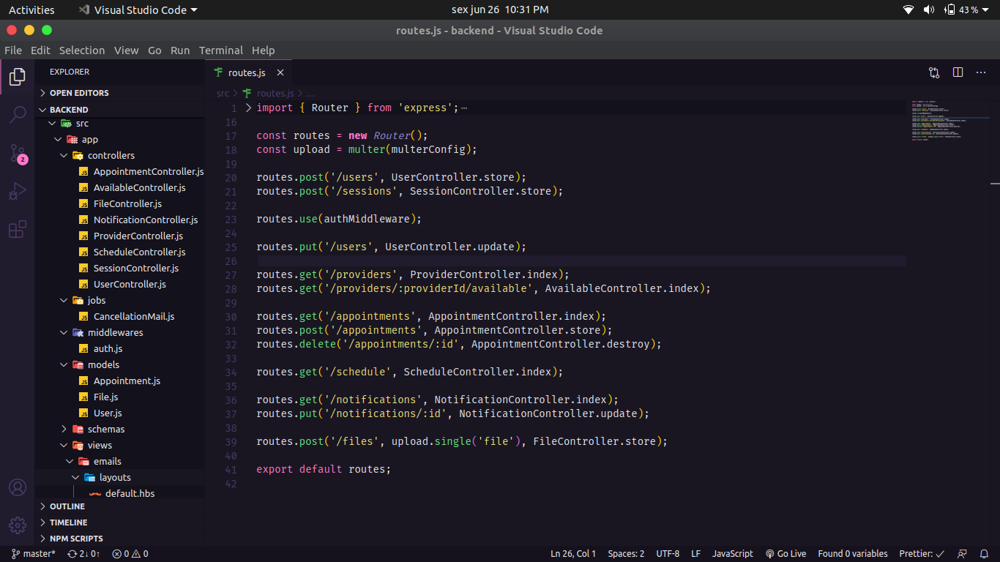

<h1 align="center">
  
</h1>

  

  

  

  

  

  

 

## 💻 Projeto

🚧 Em construção

 

## ⛏ API

<h1 align="center">
    
</h1>

## 🌐 WEB

<h1 align="center">
    GIF WEB
</h1>

## 📱 Mobile

<h1 align="center">
    GIF MOBILE
</h1>

## 🚀 Tecnologias

Esse projeto foi desenvolvido com as seguintes tecnologias:

- [React](https://reactjs.org)
- [Axios](https://github.com/axios/axios)
- [Styled Components](https://styled-components.com/)

 

  Made with 💜 by <a href="https://www.linkedin.com/in/ronnyacacio/"> Ronny Acácio </a>

